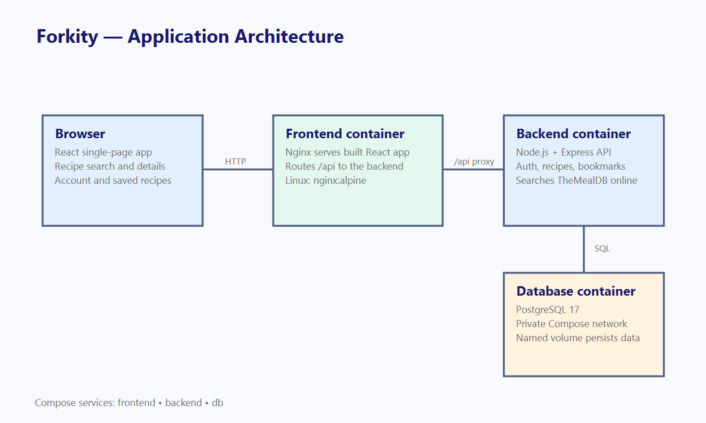

# Forkity

Forkity is a recipe hub for discovering recipes online, saving personal recipes, and viewing recipe details. This repository contains the application and its local Docker Compose setup. CI/CD and cloud deployment infrastructure belong to the separate deployment repository.

## Stack

- **Frontend:** React and Vite with custom CSS; no Bootstrap or UI framework
- **Backend:** Node.js and Express REST API
- **Database:** PostgreSQL
- **Online recipe search:** TheMealDB, requested by the backend

## Architecture

The browser loads the React frontend from the Nginx frontend container. Nginx proxies `/api` requests to the Express backend container. The backend searches TheMealDB and stores accounts, sessions, recipes, and bookmarks in the PostgreSQL database container.



The editable Mermaid source is in [docs/architecture.md](docs/architecture.md).

## Run with Docker

Requirements: Docker Engine with Linux containers and Docker Compose v2.

Create the local environment file, then replace its example database password with a strong random value:

```powershell
Copy-Item .env.example .env
```

Start all three containers from the project root:

```bash
docker compose up --build
```

Open `http://localhost:8080` (or the port set by `FORKITY_PORT` in `.env`). The frontend, backend, and database run as separate Linux containers. PostgreSQL is available only on the internal Compose network.

PostgreSQL data is stored in the named `postgres-data` volume and survives container restarts and `docker compose down`.

### Local development

For hot reload outside the containers, install Node.js 22 or newer and npm, create `.env` as described above, start the database container with `docker compose up -d db`, then run:

```bash
npm install
npm run dev
```

The Vite frontend runs at `http://localhost:5173` and proxies API calls to the local backend on port 4000.

### Existing local data

On first startup, if the PostgreSQL volume is empty and `backend/data/forkity.db` exists, the backend imports its users, recipes, and bookmarks into PostgreSQL. Sign in with your existing account afterward. Sessions are not imported, so existing users need to sign in again. The import is skipped once PostgreSQL contains Forkity data.

## Features

- Search online recipes through TheMealDB
- Open recipe details, including ingredients and instructions
- Register and sign in with a personal account
- Add, browse, and view recipes stored per account in PostgreSQL
- Bookmark recipes to your account; your added recipes and bookmarks appear together in **My recipes**
- Responsive layout styled with project-owned CSS

## Project layout

```text
frontend/       React app, custom styles, Nginx config, and image build
backend/        Express API, PostgreSQL access, SQLite importer, and image build
compose.yaml    Three-service Linux container stack
docs/           Architecture diagram and its source
```
