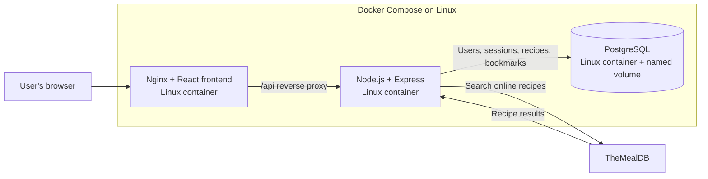

# Forkity Container Architecture

## Request flow

- Nginx serves the built React frontend and proxies `/api` requests to Express.
- The backend handles sign-in, online recipe searches, and personal recipe operations.
- The backend stores users and sessions, and reads and writes recipes and bookmarks for the signed-in user in PostgreSQL.
- The backend calls TheMealDB for online search results and returns them to the frontend.
- A named Docker volume persists PostgreSQL data across container restarts.

## Existing SQLite data

If PostgreSQL is empty and the local SQLite file is available, the backend imports accounts, recipes, and bookmarks during startup. Sessions are not migrated. Terraform, Kubernetes, and the Jenkins pipeline belong to the separate deployment repository.
