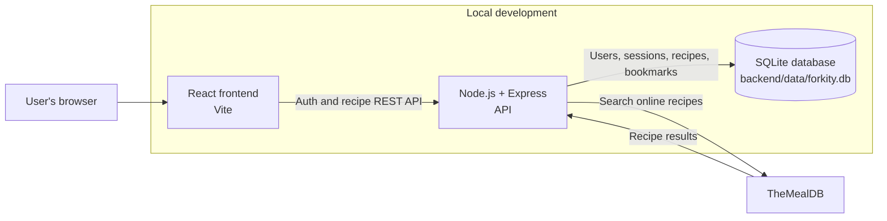

# Forkity Architecture

## Request flow

- The browser loads the React frontend.
- The frontend calls the Express API for sign-in, online recipe searches, and personal recipe operations.
- The backend stores users and sessions, and reads and writes recipes and bookmarks for the signed-in user in SQLite.
- The backend calls TheMealDB for online search results and returns them to the frontend.

## Planned containerization

The application will be containerized after the local version is complete. Terraform, Kubernetes, and the Jenkins pipeline belong to the separate deployment repository.
